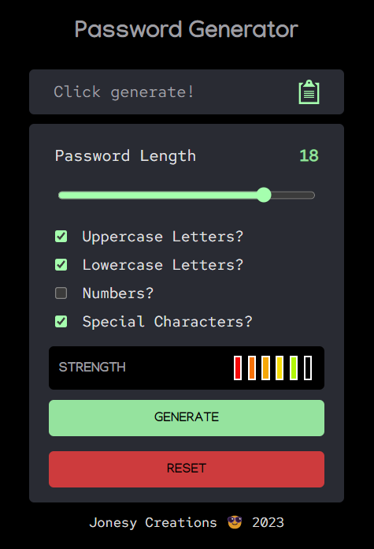

<h1>
Password Generator 🔑
</h1>

---

### App Info

A small app to quickly generate a password. Coded using HTML, CSS and JavaScript

> Deployed here: <a href="https://oliverj-password-gen.netlify.app/">Password Generator App</a>

---

### Practicing the basics

This is a small challenge to practice my basic coding skills. The basics need a bit of work at the moment - especially CSS.

---
